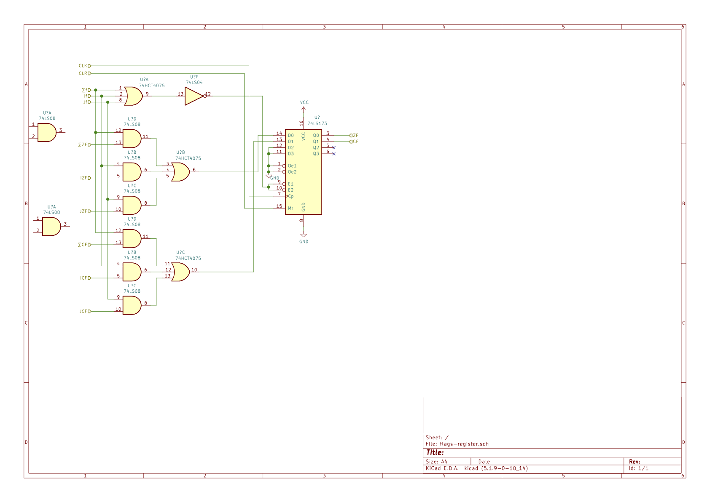
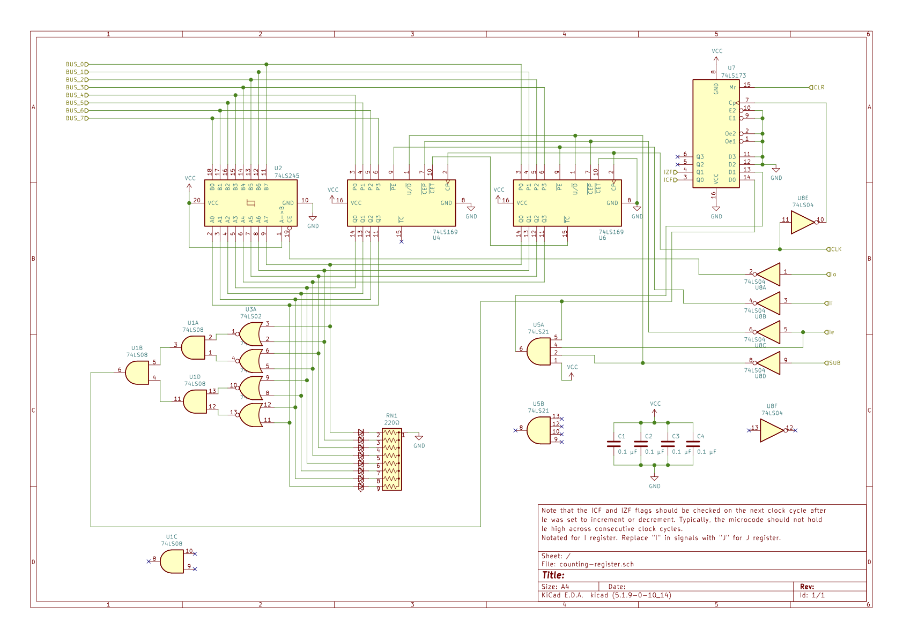
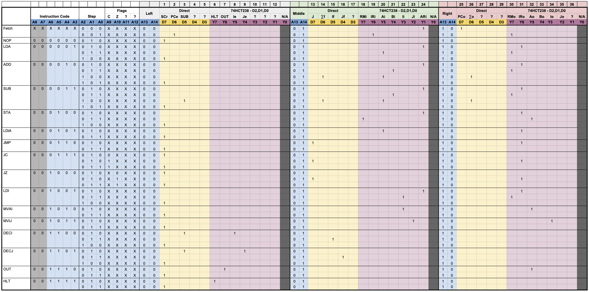
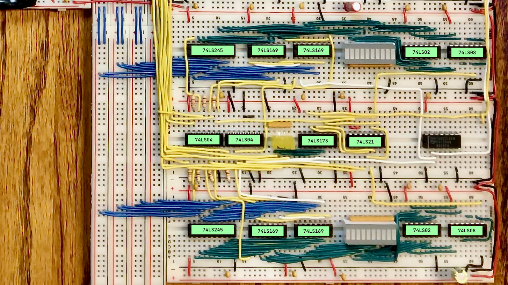

# Counting Registers for SAP-1
## Project Overview
The goal of this project is to add general purpose registers to the SAP-1 that additionally have the capability to directly increment or decrement the value held in the register and set the carry and zero flag as appropriate when the register value is incremented and decremented. The usefulness of such a register is to more easily implement loops in SAP-1 code. 

A prime example of this is multiplication. In the original SAP-1 instructions set, to implement multiplication you had to implement a loop that counted the number of times the addition operation has occurred (since "multiplication" is just "repeated addition"). However, since there is only one ALU, much of the code written was focussed on moving both the multiplicands and the loops counters in and out of registers A and B, plus a memory location was dedicated to simply hold the value of 1, which is subtracted from the loop variable in each loop. This all be much easier is we had a separate register that could independently handle the loop variable, and then registers A and B can be focussed on the multiplicand addition and much code that pertained to simply moving values in and out of register A can be removed. 

## Design

The countering register is designed around the 74LS169 Up/Down 4-bit Counter. This chip allows values to be latched into it, and then those values can be incremented or decremented when a clock signal is asserted. So given that, the start of the counting register's design is very similar to the original 74LS173-based A and B registers in the original SAP-1. However, because of the additional functionality desired in the counting register, there are a few more ICs involved.

### Dependencies
This project depends on the [Expanded Control Logic project](../expanded-control-logic) already being successfully implemented in the SAP-1. 

### Control Signal Handling
The following control signals are used in each counting register (here notated as if it were the `I` register)

| Control Signal | Active | Description |
|:-:|:-:|:--|
| `Io` | HIGH | Controls whether the current register value is written to the data bus |
| `Ii` | HIGH | When active, when cause the register to update 	 value to the data base value on the rising edge of the clock. |
| `Ie` | HIGH | When active, the register will on the clock's rising edge increment or decrement its current value depending on the state fo the `SUB` control signal |
|  `SUB` | HIGH | Will cause the `Ie` signal to decrement the register value rather than increment it. Note that this is the same `SUB` control signal that the original SAP-1 ALU uses. |
| `CLR` | HIGH | When active, will cause the temporary flags register to clear its state. Note that this does not impact the value held in the counting register. |

One thing to note is that all of the control signals are active HIGH, at least from the perspective external to the register. Internal to the register, those of these signal need to the be inverted in order to comply with a chip's need for the signal to be active LOW. To invert the control signal where needed, 74LS04 inverters are used.

### Flag Handling
#### Zero Flag Detection
In order to detect when a counting register contains a value of zero, a similar design to the original SAP-1 ALU method will be used. The 8 output bits of the register will be fedd into 74LS02 NOR gates in pairs, and the 74LS08 AND gates will be used to check that all NOR gates are asserting `1`, which would indicate all output bits are zero.

#### Carry Flag
The 74LS169 does not have a carry flag that we can use in the same way that the ALU's 74LS283 has a carry flag. The ripple carry out of the 74LS169 is normally high, and assert low when the register value of the 74LS169 is at 15 and the chip is set to count up or at 0 and the chip is set to count down. This behavior allows the ripple carry signal to be used to control the enable state of the next higher 74LS169 when multiple are chained together, but it does not quite represent what a "carry" conceptually means. The carry flag is usually set to indicate that the _results_ of a ALU operation are larger than the original bit width by 1 bit (the carry bit). In contrast, even if the 74LS169's ripple carry output is inverted, it is only set when the register value is at the maximum value (`0b1111`) when in addition mode and at the minimum value (`0b0000`) for subtract mode. 

So, to get a carry flag that behaves like the carry flag in the ALU, we need to simulate it. We would expect the carry flag to be set when the maximum register value of `0b1111` is increment (that is, 1 is added to it) and becomes `0b0000` due to the results of `0b1111` + `0b0001` being the 5 bit value `0b10000`. The register holds the lower 4 bits of that results, and the "carry flag" represents the 5th bit. The of an an increment operation causing this can be detected if the register value is zero, and the register has just completed an increment operation. To detect this, and thus set the carry flag, we must look at the state of things at the end of the clock cycle, as the various value haven't yet propagated through the various gate delays on the rising edge of the clock. The exact state is detected by ANDing together the counting register's zero flag, the counting register's enable control signal (which causes the increment to occur), and the inverted state of the `SUB` control signal (which causes a decrement instead of an increment when the register enable control signal fires). In order to reduce chips used, a 4-input AND gate, the 74LS21, is used with on of its (unused) inputs tied high. 

However, measuring the carry flag state at the end of the clock cycle means that it cannot be collected by the flags register until the next clock cycle, and by that time the state tat resulted in the carry flag being detected is no longer in place. So, a temporary flags register specific to the counting register(s) must be used so as to preserve the flag state until the next clock cycle during which the main flags register can collect the state of the counting register(s)'s flags. For this, a 74LS173 is used with the inverted main clock signal for its input clock.

#### Integration with Flag Register
The challenge with integrating one or more counting registers with the existing flags register is that now multiple modules could set the zero flag or the carry flag. The existing flags register design always reads in the current state of the zero flag or carry flag register from the ALU. When there is only one thing setting the zero flag (for example), this OK. But when multiple things could set the zero flag, signals could collide. Imagine a scenario where the ALU is adding 5 plus 3, but the `I` register isn't being used but contains a value fo zero.  If all sources of the zero flag connected directly to the flags register, the zero flag would be set despite the ALU operation not resulting in zero. A similar example could be constructed for the carry flag. 

To fix this issue, each source of a flag status must be explicitly controlled as to when it can set the flags register status or not. In some ways, Ben Eater's original SAP-1 did this with the `∑f` (or `FI` in the original notation) signal. The flags register only get set when the `∑f` signal is asserted. This can be built on by having a control line for each source of flags t control exactly which component gets to set the flags register at any given moment. So each counting register will have a `If` control signal (here notated for the `I` register) to indicate that its modules flag statuses are to be read into the flags register. This control signal must be used to  enable the 74LS173 register. Basically any module's flags enable line would enable the 74LS173. To control which module's flags status will be read, the flag status signals from each model will be AND'ed with the flags enable control signal for that module, and the results will be OR'ed together by flag type before being fed into the 74LS173. To OR together more than two lines, a 74HCT4075 is used, with has 3-input OR gates on it. 

### Data Sheets

* [74LS169 Up/Down Counter](https://www.jameco.com/Jameco/Products/ProdDS/46906.pdf)
* [74HCT4075 Triple 3-Input OR Gate](https://www.ti.com/lit/ds/symlink/cd74hct4075.pdf)
* [74LS21 Dual 4-Input Positive-AND Gates](https://www.ti.com/lit/ds/symlink/sn74ls21.pdf)
* [74LS02 Quadruple 2-Input Positive-NOR Gates](https://www.ti.com/lit/ds/symlink/sn54ls02-sp.pdf)
* [74LS08 Quadruple 2-Input Positive-AND Gates](https://www.ti.com/lit/ds/sdls033/sdls033.pdf)
* [74LS04 Hex Inverters](https://www.ti.com/lit/ds/symlink/sn74ls04.pdf)
* [74LS173 4-Bit D-Type Registers with 3-State Output](https://www.ti.com/lit/ds/symlink/sn74ls173a.pdf)

### Schematics

#### Updated Flags Register

#### Counting Register

### Microcode
On a SAP-1 with the original 16 bytes of RAM, there isn't enough room in the 4 bits used to identify an instruction to enable all instructions that would be possible with the counting registers. So any number of instructions combinations could be defined. The commands you could create using these registers include:

* `INCx` - Increment value in register `x` (`I` or `J`). If incrementing from 255, carry flag and zero is set.
* `DECx` - Decrement value in register `x`. If decrement results in zero, zero flag is set. 
* `LDx` - Load into register `x` the value found at the memory location specified in command parameter.
* `STx` - Store current value in register `x` into memory location in command parameter.
* `MVxy` - Copy (move) value in register `x` to register `y`. For example, `CPAI` would copy the value in register `A` to register `I`. 

Also, for clarity, load immediate instructions will be notated `LDiX` (note the lower case `i`) where `X` is the register the lower 4 bits if the instruction will be loaded into.

[In this directory](./microcode) is a version of the microcode generator that defines the following instructions in addition to the original SAP-1 instruction set for a SAP-1 set up with two counting registers, `I` and `J`:

* `LDI` - Load into the `I` register the value held in the memory location indicated in the command parameter.
* `MVAI` - Move (copy) the value currently held in the `A` register into the `I` register.
* `MVIJ` - Move (copy) the value currently held in the `I` into the `J` register
* `DECI` - Decrement the value fo the `I` register. Set the zero flag if the `I` register value becomes 0. 
* `DECJ` - Decrement the value fo the `J` register. Set the zero flag if the `J` register value becomes 0. 

The microcode table for this would look like the following. Note that this table indicates what control lines any given counting register control signal should be attached to.

### Construction Tips

The counting registers are especially useful when two are implemented for the SAP-1. This allows the managing of two loops in hardware, which markedly improves the computing power of the SAP-1. When laying out the registers, it is recommends that three standard size bread boards are used, and the center breadboard contains the 74LS04 inverts used to invert the control signals, the 74LS21 used to determine the state of the carry flag, and the 74LS173 used to cache the state of the zero and carry flags. Furthermore, note that only "half" of the 74LS21 and 74LS173 is used for a single counting register. Given that, it is recommended that only one 74LS21 and 74LS173 is used across two counting registers, where the second register simply uses the unused portion of the chip. For the 74LS21 that means the second register used the second gate on the chip, and for the 74LS173 the second register will use the 3rd and 4th register bit. 

It's also worth noting that a counting register can use only the gates on 74LS04 hex inverters that face it, as this will simplify wiring, and similarly with the 74LS21. Finally, being thoughtful about the gate usage arrangement on the 74LS08 in each register will allow you to route the zero flag single from a gate that faces "inward" towards 74LS173 and 74LS21 to which it needs to connect.

Here is an annotated photo of a dual counting register layout:

