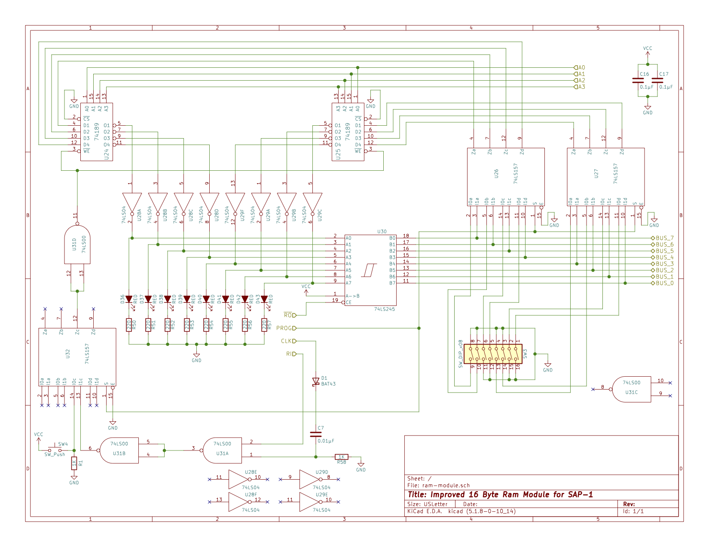

# RAM Module Reliability

## Project Overview
The design of the RAM Module in Ben Eater's SAP-1 has two issues that impact the reliability of not only the RAM module, but the SAP-1 computer as a whole. The first problem is that the RC circuit used to convert the clock signal that drives the RAM write enable line into a shorter pulse has the side effect of creating a "negative pulse" back into the clock line on the trailing edge of the click signal. The second issue is that the 74LS157 used to select whether the RAM write enable signal comes from the manual switch or from the control logic can on occasion create spurious low signals into the RAM write enable despite both of the input lines being high that the 74LS157 is selecting from. I explain the details of both of these problems, and their solution, [in a video on YouTube here](https://youtu.be/ELf-rHNZkA8):

<iframe width="560" height="315" src="https://www.youtube.com/embed/ELf-rHNZkA8" frameborder="0" allow="accelerometer; autoplay; clipboard-write; encrypted-media; gyroscope; picture-in-picture" allowfullscreen></iframe>

## Design
### Isolating the Clock Line
The design to isolate the clock line from the RC edge detecting circuit is straightforward. Simply place a Schottky diode between the clock line and the capacitor of the RC circuit. The type of Schottky diode I used is a BAT-43.

### Preventing Output Noise from the 74LS157
As explained in the video, the root cause of the spurious low pulses out of the 74LS157 used to control the source of the RAM write enable signal is how logic gate delay interacts with the underlying logic design of the 74LS157. The solution is to have the steady state input into the 74LS157 be low rather than high. To do that, the RAM write signal ultimately sourced from the clock is inverted through an extra NAND gate on the 74LS00 that was already next to the 74LS157, and the manual RAM write switch is converted to being push to make high signal. The output of the 74LS157 is re-inverted again through another extra NAND gate on the 74LS00 before being routed into the write enable lines of the RAM chips. 

## Electrical Schematic
The updated schematic of the 16 byte RAM modules can be found in this repository.

