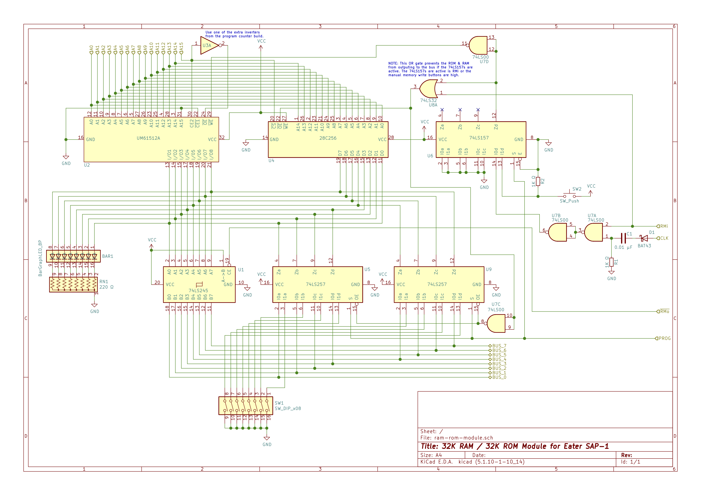
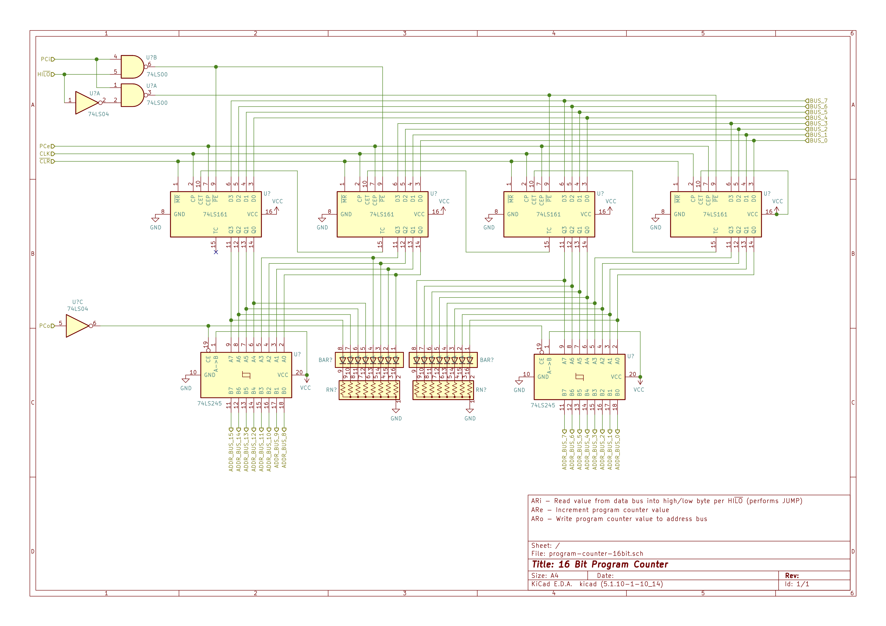
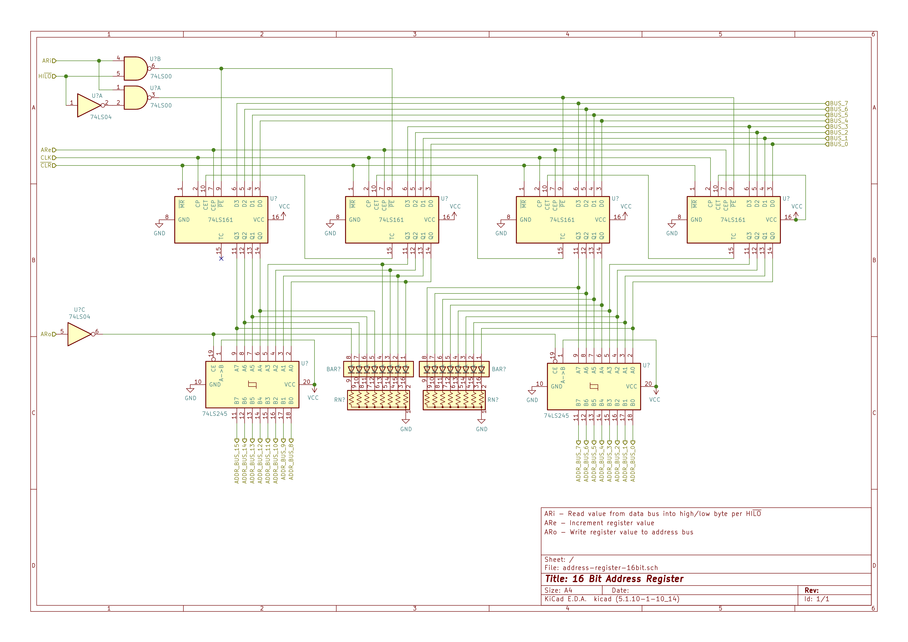
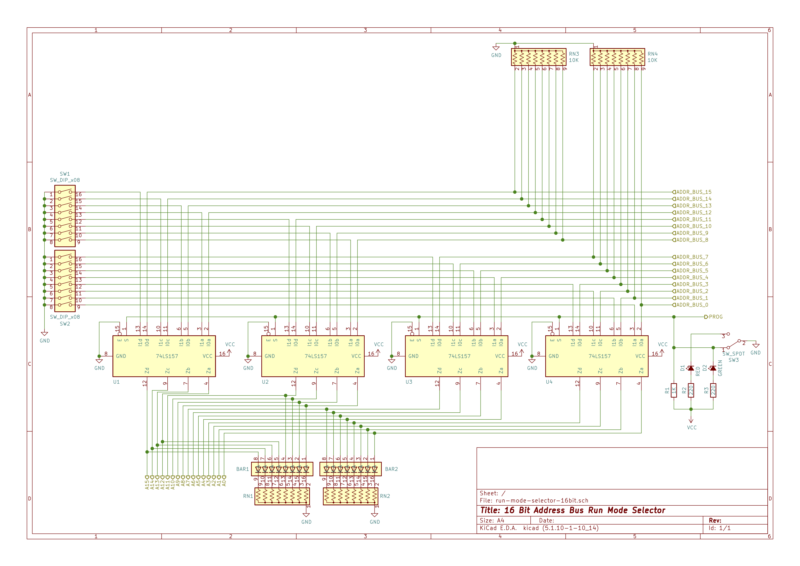
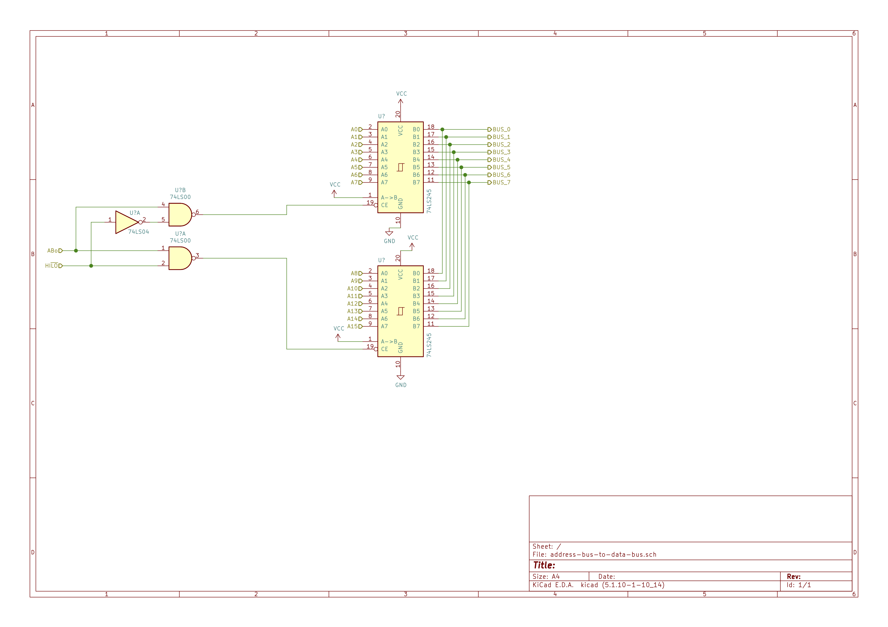
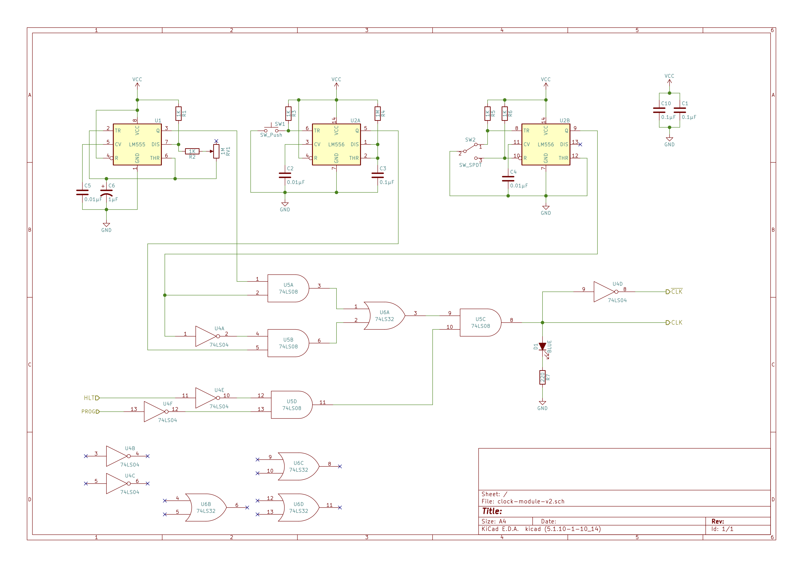

# 16 Bit Memory Expansion for SAP-1
## Overview
When doing [my last project](../calculating-factorial/) with my Ben Eater inspired breadboard TTL CPU, one thing that became obvious is that 16 bytes was a rather small amount of RAM. If I wanted to continue my learning journey that only started when I finished the [Ben Eater SAP-1 project](https://eater.net/8bit), I needed to expand the available memory to my breadboard CPU. Furthermore, needing to manually key in a program each time I power cycle the breadboard CPU got old rather quick. So, before I go any further with expanding the breadboard TTL CPU, I need to address these two issues.

Something that surprised me in the effort to expand the RAM of the breadboard computer was the realization that I had a large number of choices and that each choice would have implications on what I could do later down the road. I idea I immediately seized on was to go with 12 bit addressing, effectively using the lower 4 bits of the instruction codes for the top 4 bits of an address, and then use the next byte after that for the lower 8 bits of the address. This appeared to be the most minimal departure from Ben Eater's original design, but it had the issue that I'd still be bound by 4 bit instruction codes. 

Then the debate was should I expand the instruction code bits to 6, and then use 10 bit addressing. This would get me 1K of RAM, which for the learning purposes of the breadboard CPU, seemed sufficient. However, the issues here is that 10 bits would just be an awkward size when it comes to the program counter, memory address register, and so on. 

So, I just bit the bullet and decided to go with full 16 bit memory addressing. Selecting this choice leads to some necessities in the design, specifically the creation of an address bus and defining how that will behave, but that was all OK because it forced me to really think about the design, which in the end is the goal of this project anyway: learning by doing. 

### Design Goals

* The memory space should use 16 bit addressing
* Have both ROM and RAM in the memory address space.
  * ROM would be used for a boot-loader, common subroutines, and programs
  * 32K of ROM and 32K of RAM. The ROM will be `0x0000` though `0x7FFF`, and the RAM will be at `0x8000` through `0xFFFF`.
* Both the program counter and memory address register should be 16 bit registers.
* Like the program counter, The memory address register should enable being incremented in order to quickly get the next location in memory. 
  * This feature is actually needed due to memory address values now occupying two bytes, and we want our instruction parameters to just point at the first byte.
 * This would be controlled by microcode.
* For multi-byte values in RAM, such as memory addresses and 16-bit integers, the values will be arranged as little endian.
  * This makes implementing multi-byte math so much easier later on. It does make data entry a little less intuitive. 
  * The program counter and memory address register will be physically arranged as big endian to make the LEDs used to represent their values more human interpretable.
* Implement an assembler similar to [the `customasm` tool](https://github.com/hlorenzi/customasm).
  * This is done to make creating the ROM images easier. 
* Smaller clock footprint
  * This project a larger than normal breadboard footprint. In order to save save, the clock module is made smaller by using a LM556 dual timer chip in replacement to two LM555 timers.  
  * Also, the sense of the `PROG` signal is changed to a HIGH indicating that the computer should be in manual program mode. This requires a small change to the [Halt system clock when programming](../clock-halt-when-programming/) project.


Not in scope for this project:

* While expanding the RAM and how it is addressed is the necessary prerequisite to allowing the instruction register use more than 4 bits for instruction codes, this project will not accomplish instruction register expansion. 


## Design Approach


### RAM and ROM
With a 16 bit address space, the computer will be able to address a total of 64K of memory. There are many ways to allocate the memory space's usage. Here, we are going to simply evenly split the memory space between ROM and RAM, with the ROM being in the lower 32K of the address space. Both the ROM and RAM could be used for program code, with the ROM code being burned onto the ROM and the RAM code being manually entered via DIP switches. Since only RAM will be mutable at run time, all variables for any cod should be in the RAM address space even if the program code is in ROM. 

A simple visualization of memory space is as follows:

```
    0xFFFF  +-----+
            |     |
            | RAM | <-- Variables, programs
            |     |
    0x8000  +-----+
            |     |
            | ROM | <-- Boot code, programs
            |     |
    0x0000  +-----+

```

To implement this, a 28C256 EEPROM will be used for the ROM and a UM61512AK-15 will be used for RAM. In order to select whether the RAM or ROM is active, address line 16 (the MSB) will be routed to each chip's enable rather than an address input on the chip. Fortunately, the 28C256 chip enable is active low and the UM61512AK-15 chip enable is active high, thus making it very straightforward as to which chip should be active based on the MSB of the address. 

One design challenge that had to be overcome is that the UM61512AK-15 uses the same pin for both data input and data output. This creates the potential for bus contention if the RAM is outputting a value at the moment a value is read in from the data bus. Bus contention could also occur if the 74LS157 2-to-2 multiplexers are used to switch between input from the DIP switches and input from the data bus. The reason for this is that when inactive, the 74LS157's output pins are set to LOW. This creates a short circuit if the RAM or ROM chip are writing a HIGH to any data line. In order to address these issues, 74LS257 2-to-1 multiplexers are used instead, as these chips have a tri-state output and places the output lines to high impedance if the chip is set to inactive. Then, logic is added to ensure that the 74LS257s are only active when the RAM chip is reading from the data lines. Otherwise, the 74LS257s will be set inactive so bus contention does not develop when either the RAM or ROM are writing to the data lines.



### Program Counter
Since this memory module has a 16 bit address space and I wish to make all of it available to code, the program counter itself needs to be a 16 bit counter. This is accomplished by using four 74LS161 4-bit counters. The design is similar to the original Eater SAP-1 program counter, but with four counters rather than one.

Another difference is in how the program counter reads in data from the data bus for the purpose of jump instructions. Since the program counter is 16 bit and the data bus is 8 bit, setting the program counter value from the data bus requires two read operations. To signal this, a `PCi` signal is used to indicate that the program counter should read in from the bus, and a `HILO` signal is used to indicate whether the bus value should be placed into the high byte or low byte of the program counter. The `HILO` signal is in fact reused through out the breadboard computer's design to generally indicate whether the operation pertains to the high or low byte of a 16-bit word. 



### Memory Address Register
In this design, the memory address register is used to load address values from the data bus and then use them to indicate what address in memory should be read. Now that memory addresses themselves are multi-byte values, it is expected that we will increasingly want to read multiple consecutive bytes of data from memory. Given that, it would be convenient if the memory address register could increment itself rather than requiring an ALU operating simply to add 1 to the current memory address. to accomplish that, the memory address used 74LS161 4-bit counters similar to the program counter. In fact, the general design of the memory address register and the program counter are identical. 



### Address Bus

In the original Eater SAP-1 design, the memory address register is the interface for anything that wants to fetch a value from memory. The program counter could set the memory address register, and so could the instruction register. All of this was done through the data bus. However, in a 16 bit address space with a 8 bit address bus, this design is problematic. 

The nature of the problem is due to memory addresses now requiring two bytes. Consider the `LDA` instruction. With a 16 bit address, the `LDA` instruction will be represented in 3 bytes. The first byte is the instruction code, and the next two bytes are the memory address of the value that should be loaded into register A. The problem arises in that loading the address into the memory address register is a two step operation. The following steps for the `LDA` instruction illustrates the problem:

1. The program counter points at the instruction code for the `LDA` instruction. This address is loaded into the memory address register, and then the memory value is loaded into the instruction register.
2. The program counter is incremented to now point at the first byte of the address of the value to be loaded into register A. This address is loaded into the memory address register, and the first byte of the value address is written onto the data bus and back into the low byte of the memory address register (remember, we are using a little endian design). 
3. The program counter is incremented again to point at the second byte of the address of the value to be loaded into register A. However, if we write this address to the memory address register to be able to fetch the value, it would overwrite the first byte of this value's address that was placed in the memory address register in step 2.  

Therein lies the problem of continuing with the SAP-1 of the memory address register being the only entity that can set the address that memory will fetch from. To solve this problem, we introduce an address bus concept to the design. The basic approach to this design is that multiple entities can write to the address bus, but only one at a time. The memory will fetch the value at whatever address is currently being written to the address bus, and then write that value to the data bus. This means that both the program counter and memory address register can both write to the address bus, but obviously they should not do so at the same time. 74LS245 bus transceivers are used to arbitrate which register is writing to the address bus. 

Added to the address bus design is a way to output the address bus value to the data bus. This feature would enable performing arithmetic on the address value beyond the simple increments that the program counter and the memory address register currently enable. 

Finally the address bus's connection to the address lines of the memory ICs is arbitrated by a set of 74LS157 2-to-1 multiplexers. This design enables a run mode switch, which indicates whether the memory address should be read from the address bus or a set of microswitches that are used when manually keying memory values. 






### Compact System Clock
Purely for layout reasons, the system clock was redesigned to slightly reduce chip count and in turn fit within a smaller footprint on the breadboard. This was done because the combination of the memory module, program counter, and memory address register require much more breadboard footprint than the previous RAM design did. Instead of using three 555 timers, the system clock now uses one 555 timer and one 556 dual timer. Other than that, the clock design is functionally the same. 



## Component Data sheets

* [UM61512AK-15](./datasheets/UM61512A.pdf) - 64 K x 8 bit SRAM. Any 32K or larger SRAM chip could be used for this project with minimal modifications. 
* [AT28C256](https://www.mouser.com/datasheet/2/268/doc0006-1108095.pdf) - 32K x 8 bit EEPROM. Any 32K or larger EPROM could be used with minimal modification to the wiring. EEPROMs are convenient for reprogramming, which we will likely do often.
* [74LS161](https://www.ti.com/lit/ds/symlink/sn54ls161a-sp.pdf) - A 4-bit counter
* [74LS245](https://www.ti.com/lit/ds/symlink/sn54ls245-sp.pdf) - Octal Bus Transceivers With 3-State Outputs
* [74LS00](https://www.ti.com/lit/ds/symlink/sn74ls00.pdf) - Quadruple 2-Input NAND Gates
* [74LS04](https://www.ti.com/lit/ds/symlink/sn74ls04.pdf) - Hex Inverters
* [74LS32](https://www.ti.com/lit/ds/symlink/sn74ls32.pdf) - Quadruple 2-input OR gates
* [74LS157](https://www.ti.com/lit/ds/symlink/sn74ls157.pdf) - Quadruple 2-to-1 Line Data Selector/Multiplexer
* [74LS257](https://www.ti.com/lit/ds/symlink/sn74ls257b.pdf) - Quadruple 2-to-1 Line Data Selector/Multiplexer with Tristate Output
* [555](https://www.ti.com/lit/ds/symlink/lm555.pdf) - LM555 Timer
* [556](https://www.jameco.com/Jameco/Products/ProdDS/24328.pdf) - LM556 Dual Timer

## Integration with Breadboard Computer

### Breadboard Layout

### Connecting to Control Logic
At this point in the breadboard CPU's evolution away from the original Eater SAP-1 design, the following control lines are in use. Some control lines are marked as **New** or **Updated** in comparison to the previous [Increment Registers](../increment-registers/) project.

| Symbol | Title | Description |
|:-:|:--|:--|
| `SCr` | Step Counter Reset | Resets the microcode step counter to zero. |
| `PCe` | Program Counter Enable | Increments the current value in the Program Counter |
| `SUB` | Subtract | Signals that math operations should be subtraction |
|`HILO` | High/Low Byte Selector | Controls which byte of a 16 bit register is being operated on when interacting with 8-bit data bus. **New** |
| `HLT` | Halt | Stops the system clock. |
| `OUT` | Output Data Bus | Writes data bus value to the display register |
| `Ie` | I-Register Enable | Increments the value in the I register, or decrements is `SUB` is set |
| `Je` | J-Register Enable | Increments the value in the J register, or decrements is `SUB` is set |
| `ARe` | Address Register Enable | Increments the current value in the Address Register. **New**|
| `PCi` | Program Counter In | Renamed `J` control line, which sets the program counter to the data bus value. Used in conjunction with `HILO`. **Updated** |
| `∑f` | ALU Flags | Load flags register with current flags from ALU |
| `If` | I Register Flags | Load flags register with current flags from I register |
| `Jf` | J Register Flags | Load flags register with current flags from J register |
| `RMi` | RAM Value In | Loads into RAM at the current memory address the current data bus value. No action of current memory address points to ROM. |
| `IRi` | Instruction Register In | Loads into the instruction register the current data bus value. |
| `Ai` | A Register In | Loads into the A register the current data bus value. |
| `Bi` | B Register In | Loads into the B register the current data bus value. |
| `Ii` | I Register In | Loads into the I register the current data bus value. |
| `Ji` | J Register In | Loads into the J register the current data bus value. |
| `ARi` | Address Register In | Loads into the address register the current data bus value. Used in conjunction with `HILO`. **Updated** |
| `PCa` | Program Counter to Address Bus | Writes the current program counter value to the address bus. This replaces the original `PCo` control line which wrote the program counter value to the data bus. **New** |
| `∑o` | ALU Out | Writes to the data bus the current ALU results value |
| `ARa` | Address Register to Address Bus | Writes the current address register value to the address bus. **New** |
| `ABo` | Address Bus Out | Writes to the data bus the current value being written to the address bus. Used in conjunction with the `HILO` control line.  **New** |
| `RMo` | RAM Value Out | Writes to the data bus the memory value at the current memory address. |
| `IRo` | Instruction Register Out | Writes to the data bus the lower bits of the instruction register that are not part of the instruction. |
| `Ao` | A Register Out | Writes to the data bus the current value in the A register. |
| `Bo` | B Register Out | Writes to the data bus the current value in the B register. |
| `Io` | I Register Out | Writes to the data bus the current value in the I register. |
| `Jo` | J Register Out | Writes to the data bus the current value in the J register. |

### Control Logic Microcode
The big challenge in developing the microcode for the this project is the fact that the memory addresses are now 16 bits. Since we are not upgrading the instruction register in this project, the instruction is still 4 bits, but a 16 bit address can't fit in the bottom 4 bits of the instruction byte (obviously), so now we are in the world of multibyte instructions. Furthermore, it will take more than one instruction step to move the 16 bit address through the 8 bit data bus. 

When figuring out how to change the design to handle the above facts, probably the biggest decision to make is whether multibyte values should be saved in RAM/ROM as [big or little endian](https://en.wikipedia.org/wiki/Endianness). The endianness of a computer is really a design choice, one is not better than the other, but each have design implications. To make the choice here, I am going to consider what I am looking to do next. Eventually I do intend to implement multibyte math operations. To do this using an 8 bit ALU requires that the math operations start on the lest significant byte, and the moving forward through the higher order bytes, carrying the carry bit of each previous 8 bit math operation. This is more easily done with multibyte numbers that are arranged with little endian, as the first memory address of the multibyte number is the least significant byte. 

So given the choice of little endian, what does this mean for how instructions are laid out in memory and then acted on in microcode? To a get a general sense, let's investigate the `LDA` instruction to load the value at memory address 0xABCD into register A. Using the original Ben Eater SAP-1 4-bit instruction value, the instruction machine code would look like this:

```
 Byte:    0      1      2
      | 0x1X | 0xCD | OxAB |
          ^      ^      ^
          |      |      |
  Instruction   LSB    MSB
```

The upper 4 bits of the first byte contain the instruction code of `0001`, or `0x1` in hex. The lower 4 bits of the first byte used to be the memory address for this command under the original Eater SAP-1 design, but now it is ignored in this transitional instruction set. The second byte is the least significant byte of the address, since the least significant byte goes first in little endian encoding. This leaves the third byte of the full instruction encoding to be the most significant byte of the address value. A similar pattern can be described for the other instructions.

The next question is how the microcode will work when the full set of information for the instruction is spread across multiple bytes. Again, let's take a close look as to how the `LDA 0xABCD` instruction would be acted on in microcode:

| Step | Active Control Lines | Description |
|:-:|:--|:--|
| 0 | `PCa`, `RMo`, `IRi`,  `PCe` | At the start of any instruction, we expect the program counter is already pointing at the first byte of the next instruction, so the first task is to move the byte value at the program counter address into the instruction register. Here, we write the program counter value to the address buss (`PCa`), which will cause the memory to make available the value at that address. Then we write the memory value to the data bus (`RMo`) and write whats on the data bus into the instruction register (`IRi`). Finally, increment the program counter to point at the next memory address. We don't know yet whether that memory address is the next instruction or a parameter to the current instruction. |
| 1 | `PCa`, `RMo`, `ARi`, `PCe` | We now know we are doing the `LDA` instruction, which means the program a counter is now pointing at the LSB of the address from where to read the value into register A. So, we write the value at that address into the lower byte of the address register. Note that the `HILO` line is not LOW here (not activated), so that state in combination with `ARi` causes the data bus value to be written to the lower byte of the address register. Finally, in the next step we will need to next get the MSB of the instruction parameter, so increment the program counter. |
| 2 | `PCa`, `RMo`, `ARi`, `HILO` | We now write the value at the third byte in the instruction to the MSB of the address register. |
| 3 | `PCe`, `ARa`, `RMo`, `Ai` | We increment the program counter so that it now points at the next instruction. At the same time we can write the address register value to the address bus (`ARa`), and then writing the memory value at that address to the data bus (`RMo`) which in turn is written into register A (`Ai`) |
| 4 |  `SCr` | The instruction is done, so reset the step counter (`SCr`). |

The rest of	 the instructions would follow similar patterns with respect to handling multi-byte instructions. The key point here is that the program counter is now incremented not just to get the next instruction, but to also fetch all bytes in the current instruction. 

The microcode table for the original Eater SAP-1 instruction set [can be viewed here](http://bit.ly/breadboard-cpu-16-bit-addressing-4-bit-instructions). A YAML configuration for generating the control lines EEPROM images [can be found here](microcode/upgrade-ram-4-bit-instructions-microcode.yaml), which is used with [the microcode generator here](../microcode-generator).

## Programming 

### Boot Loader 
If it is desired to manually key in a program using the microswitches, the device now needs a simple boot loader to handle the fact that when reset, the program counter will be pointing at address `0x0000`, which is in ROM. To get the program counter to jump to the start of RAM at address `0x8000`, a simple ROM image was created that has the `JMP 0x8000` instruction at address `0x0000`. The ROM image may be [found here](bootcode).

### Assembler
In order to create ROM images or even to more easily calculate the machine code to be manually keyed into RAM, an [assembler](https://en.wikipedia.org/wiki/Assembly_language#Assembler) is a useful tool. However, there exists no assembler for my breadboard computer. To address that, I wrote an assembler called [BespokeASM](https://github.com/michaelkamprath/bespokeasm). The key feature I needed in the assembler was the ability to easily change the instruction set architecture that the assembler builds to. BespokeASM allows the creation of a configuration file where the instruction set that should be use to generate machine code is defined. Instructions on how to install BespokeASM can be [found at the BespokeASM wiki](https://github.com/michaelkamprath/bespokeasm/wiki/Installation-and-Usage). 

The BespokeASM configuration file for the breadboard CPU's instruction set at this point in it's evolution [can be found here](examples/kamprath-16bit-addr-4bit-instrs-bespokeasm.yaml), and example programs can be found in [the examples directory](examples).


