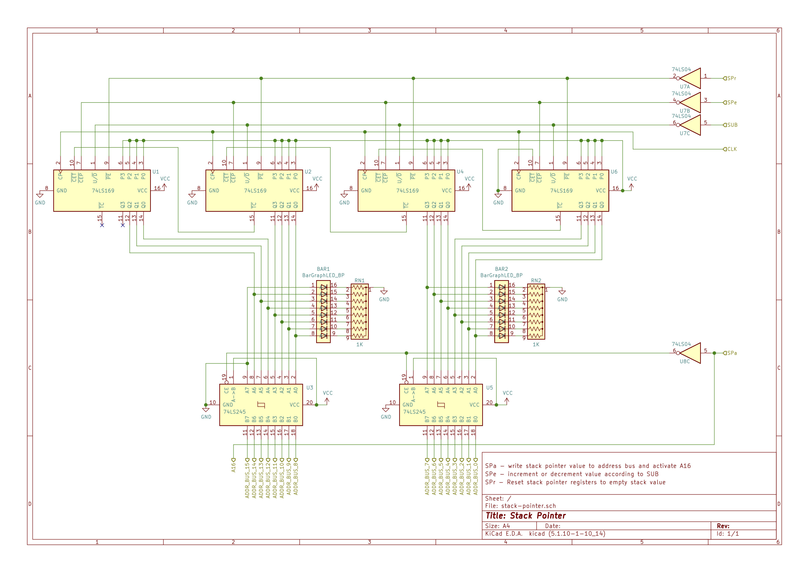
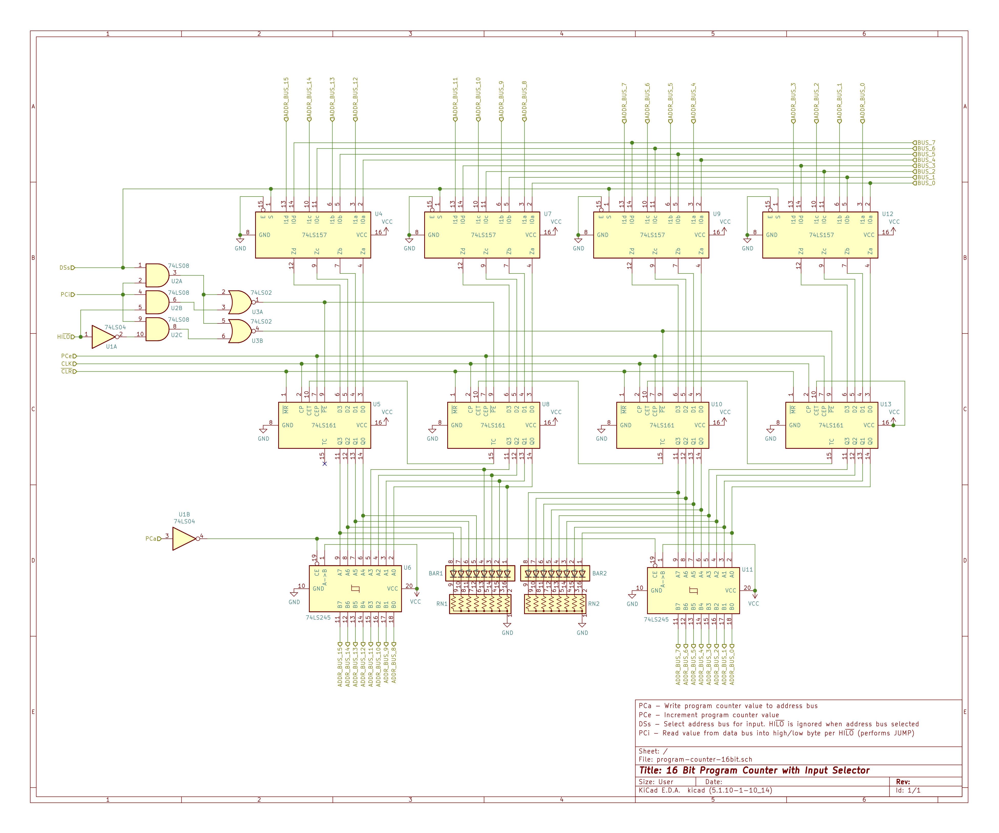
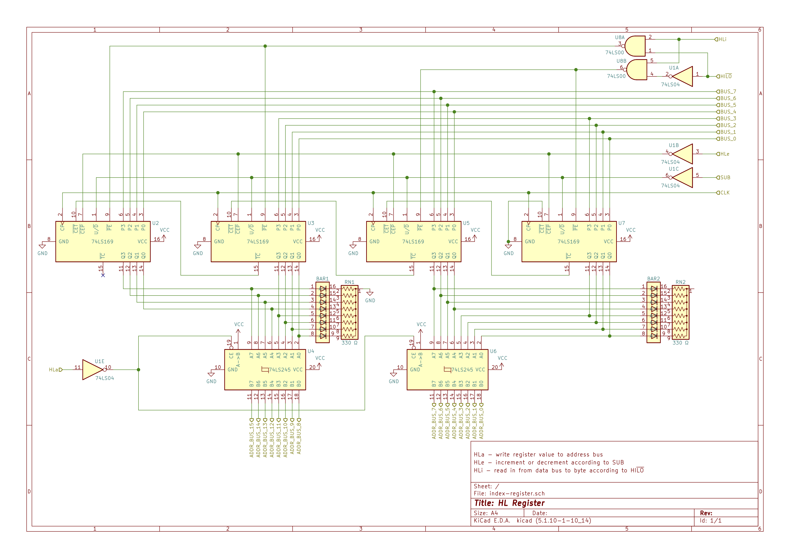
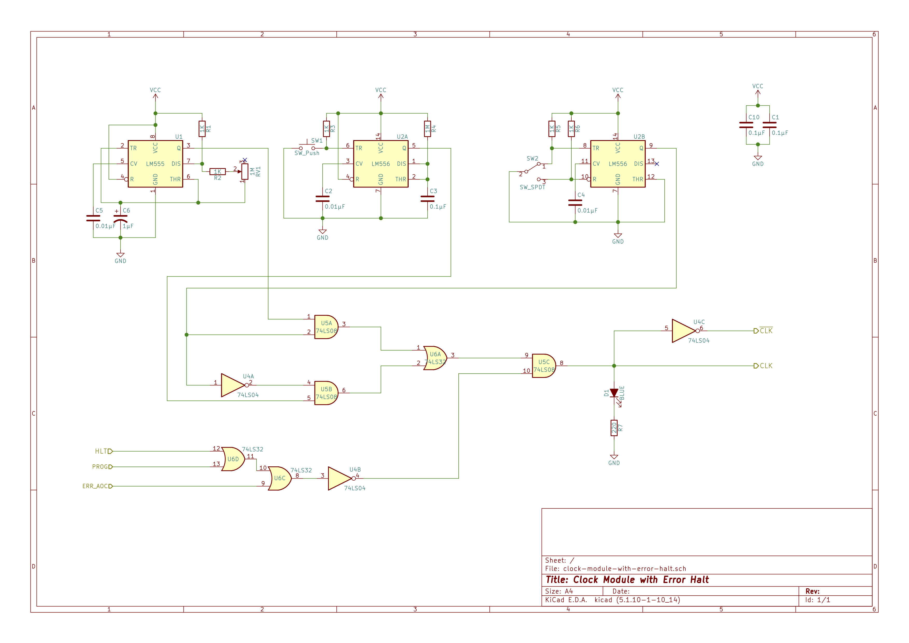

# Stack Pointer

## Overview
I'm finally at the point where I can add what I feel is the key upgrade to my SAP-1 based TTL computer: a stack pointer. A stack pointer enables general purpose programming in a computer, specifically the ability to call and return from subroutines and the ability to effectively make temporary variables in memory.

# Design

## Stack Pointer
There are plenty of resources that describe stack pointers online, so I am not going to go in detail here. But at a high level, you can think of the stack as a "pile" of memory that can place values on to the top of the pile or take values from the top of the pile. A stack pointer points to where the top of the pile of memory is. For the PUTEY-1, here are the behavioral requirements of the stack pointer:

* Given that the PUTEY-1 is an 8-bit system, multibyte values get pushed on to the stack one byte at a time.
* The stack pointer should point to the start of a multibyte value.
  * This means that for a multibyte value, the second byte is at an address value of one greater than stack pointer value. This in turn implies that the stack should "grow down" from the largest stack address value to smaller address values as values are pushed onto the stack.
  * When pushing multibyte values onto the stack, the most significant byte should be pushed first and the least significant byte pushed last.
* Stack pointer points at the last value pushed on the stack. This means it needs to be decremented before something is pushed onto the stack.

Given these goals, the design used for the stack pointer is to leverage four `74LS169` up/down counters. The stack pointer will have the concept of being "reset" to its starting value of `$FFFF`. This is done by tying high all of the `74LS169` inputs, and routing the `SPr` (stack pointer reset) control line to the load pins on the up/down counters.

### `push` and `pop`
The basic stack related instructions is to place data onto the stack and to take data off of the stack.

The instruction to place data onto the stack is called `push`, which takes one operand indicating the 8 bit value source. The microcode for this instruction first decrements the stack pointer, then copies the 8-bit value from the source indicated by the operand to the memory address now pointed to by the stack pointer. I also implemented a `push2` instruction that pushes 2 bytes on onto the step in the proper order to maintain the endianness of the 16-bit value.

The instruction to take values from the stack is called `pop`, which takes one operand indicating the 8 bit value destination for the value that is currently on the "top" of the stack. The microcode for this instruction first copies the value at the memory address that the stack pointer current points at to the destination specified in the operand, then it increments the stack pointer. I also implemented a version of `pop` with no operand, which can be used to remove a value from the stack (increment the stack pointer) without copying the value anywhere. Similar to `push`, a two-byte version of `pop` called `pop2` exists, and it writes the two byte value that starts at the top of the current stack to the specified 16-bit destination.

### Subroutine Calling
The concept of a subroutine is a section of code that you can jump to from anywhere in the overall codebase, and then when that subroutine's code is complete, the program's execution will automatically jump back to the instruction after the jump to the subroutine. To make this happen, before jumping to the subroutine the address after the jump instruction is pushed onto the stack, and the jump to the subroutine occurs. When the subroutine is done, the address that was pushed onto the stack is removed (popped) from the stack and placed into the program counter to effect a jump back to instruction after the jump to the subroutine.

The individual steps to make all this happen can be consolidated into two instructions:

* `call X` - The `call` instruction takes one operand which is the address of the subroutine that will be jumped to. Before jumping to that address, the address after the `call` instruction and its argument is pushed onto the stack.
* `ret` - The `ret` (return from subroutine) instruction will pop an address value from the stack and place it in the program counter, thus effecting a jump to that address.

#### Setting Program Counter with Address Bus Value
The `call` instruction has a lot happening. Load immediate address, push value of program counter to stack, set program counter to the address. This sequence of control lines needed 9 total steps (including prefix) to make that instruction work given the current hardware design, but the step counter only allows for 8. I could have changed the control logic to allow a step counter with 16 steps, but that didn't seem like the best  and would require me to change the instruction register I just built. So I ended updating the design of the program counter to be able to read in a value either from the data bus or the address bus. To do this, `74LS157` 2-to-1 multiplexers were used to enable the selection of input to the program counter. When reading from the data bus, the `HILO` control line is used to moderate which program counter byte the data bus is being read into.

## Address Offset Register
Having a stack pointer is great, but with a stack pointer alone you can only fetch what ever is on top of the stack. It would be desirable to be able to read (or write) a stack value that is any number of positions into the stack. A usage paradigm for this would be to push a subroutine's argument values on to the stack, and then within the subroutine be able to read (or even alter) the argument values push onto the stack. You wouldn't want to pop values off the stack to get to the subroutine's arguments because in doing so you would pop the return address off the stack since it was the last thing pushed onto the stack before jumping to the subroutine. So being able to read or write to stack memory at specific offsets from the current stack pointer would be useful.

To accomplish this, I introduce an address offset register to the design. This register is actually more than just a register, as it includes an adder that adds the value of the register to the current value on the address bus. The address offset register sits between the address bus that the various address registers (step counter, MAR, etc) write to and the address bus that the memory devices use to identify what memory address to read or write. In this way, the address offset register can alter the address emitted by more than just the stack pointer, however the stack pointer is the impetus for adding it. For clarity, I will refer to the address bus connected to memory devices as the memory address bus.

In order to keep things simple, the address offset register in my design is only 8 bits, assumed to always be positive. The register itself is implemented with two `74LS173` 4-bit registers, and the adder consists of four `74LS283` 4-bit adders. The address offset register is only connected to the lower 8 bits of the adders, with the equivalent inputs for the upper 8 bits of the adders tied to zero. The address offset register's input is connected to the data bus so that its value can be set. The address bus is the other input to the adders, and the adders output goes to the memory address bus. Given this configuration, the address offset can be applied to any address register source, however, I will only be enabling it in the microcode for the stack pointer, memory address register, and the [`HL` register](#16-bit-register-hl).

### Address Plus One Control Line
When dealing with 16-bit values in 8-bit memory systems, one frequent operation needed is to increment an address value by 1 in order to get the second byte of the 2 byte value. To make this easier, I fed a control line into the carry in of the address offset register `74LS283` adder that represents the least significant 4-bits. I called this the "address plus one" control line, notated `AP1` in my design. This allows the address value used to be incremented for an instruction step by simply asserting the `AP` control line and without needing to change the address value in the register it resides.

## 16-Bit Register `HL`
The stack pointer cannot have its value directly set from either the address or data bus. However, we can create a 16-bit register that can have its value set from the data bus and write its value to the address bus to set the active memory address or the the data bus for general computations. Furthermore, like the stack pointer, this register can be made to increment and decrement its value. This register can be thought of as another memory address register, but your code is in complete control of its usage as it is not ever used implicitly by the microcode like the memory address register is.

The design used leverages the `74LS169` up/down counters in much the same way as the [increment registers](../increment-registers/) do, but set up for a 16-bit register. Unlike the increment registers, I did not add any carry or zero value flag detection circuitry, but I may change this in the future. The register reads from the address bus 8 bits at a time using the `HLi` control line and the `HILO` control line to control which byte is being read. The register can write its value to the address bus using the `HLa` control line. To write the `HL` register value to the data bus, the `HLa` control line is used in combination with the `ABo` control line which in combination with the `HILO` control line will transfer one of the address bus's bytes to the data bus.

The microcode will be set up such the `HL` register's individual bytes can be accessed as if they were 8-bit registers, `H` and `L`. Here `H` stands for the high byte of the `HL` register and `L` stands for the low byte. Accessing the individual byte of the `HL` register can be a convenience when constructing 16-bit values from 8-bit values. The 8-bit sub-registers of the `HL` registers can be accessed most anywhere in the machine code and microcode most anywhere that other 8-bit registers can be used.

The `HL` register I implemented is "incomplete" in some ways. Due to breadboard space, I was not able to add zero and carry flag detection for the increment and decrement operations.

## Halt on Error
I have implemented a few error conditions into the design. These error conditions represent states for which there is no clear "next step" for the hardware. I would consider it to be a programming error if the states were ever achieved, however, the CPU wouldn't be able to gracefully recover without an undesirable amount of additional hardware. So I turn these error states into control signals that will cause the system clock to halt. At that point the only possible recovery is to manually reset the CPU.

The error states implemented in this project are:
* `ERR_AOC` - The address bus and the address offset value sum up that causes a carry beyond 16 bits to occur.

I wanted to add error for both the stack pointer and `HL` register to capture when they roll over from `0xFFFF` to ` 0x0000`, or the other way too, but it turns out that would require more additional hardware than I have room for on the breadboards. So, for now, causing the stack pointer or `HL` register to roll over in either direction will be considered a programming error.

## Control Line Assignment
This project continues to use the control logic design introduced in the [8-Bit Instruction Register project](../instruction-register-8-bit/). The control line assignments are:

| Control Line Position | Bank | Group | Symbol | Notes |
|:-:|:--|:--|:-:|:--|
|1 | Left | Direct | `HILO` | Indicates which byte of a 16-bit register is being operated on |
|2 | Left | Direct | `PCa` | Write program counter value to address bus |
|3 | Left | Direct | `ARa` | Write memory address register value to address bus |
|4 | Left | Direct | `SPa` | Stack pointer address activate |
|5 | Left | Direct | `HLa` | `HL` register address activate |
|6 | Left | Direct | `AOa` | Write Address Offset results to address bus adder |
|7 | Left | Direct | `XTD` | Activate extended instruction bit |
|8 | Left | Direct | `AOi` | Address Offset register in from data bus |
|9 | Left | Direct | `PCi` | Read data bus value into single program counter byte indicated by `HILO` |
|10 | Left | Direct | `IRi` | Read data bus value into instruction register |
|11 | Left | High | `MDi` | Memory device read from data bus |
|12 | Left | High | `Ai` | Read data bus value into `A` register |
|13 | Left | High | `Ti` | Read data bus value into temp register (attached to ALU) |
|14 | Left | High | `HLi` | Read data bus value into single `HL` register byte indicated by `HILO` |
|15 | Left | High | `Ii` | Read data bus value into `I` register |
|16 | Left | High | `Ji` | Read data bus value into `J` register |
|17 | Left | High | `ARi` | Read data bus value into single memory address register byte indicated by `HILO` |
|18 | Left | Low | `PCe` | Activate program counter increment |
|19 | Left | Low | `ARe` | Activate memory address register increment |
|20 | Left | Low |  `SPe` | Iincrements stack pointer value,  or decrements when `SUB` is active |
|21 | Left | Low | `Ie` | Activate register `I` increment, or decrement when `SUB` is active  |
|22 | Left | Low | `Je` | Activate register `J` increment, or decrement when `SUB` is active |
|23 | Left | Low |  `HLe` | `HL` register increment enable |
|24 | Left | Low |  | *unused* |
|25 | Right | Direct | `SUB` | Indicates whether the addition operation should instead be a subtraction operation |
|26 | Right | Direct |  | **Reserved:** `CRY`: input carry flag to ALU operation |
|27 | Right | Direct |  | **Reserved:** ALU `S0` |
|28 | Right | Direct |  | **Reserved:** ALU `S1` |
|29 | Right | Direct |  | **Reserved:** ALU `S2` |
|30 | Right | Direct |  | **Reserved:** ALU `S3` (1 for Shift, Rotate, etc; 0 for ALU) |
|31 | Right | Direct |  | **Reserved:** `INTr` (reset interrupt status) |
|32 | Right | Direct |  | **Reserved:** `INTi` (load interrupt status) |
|33 | Right | Direct | `AP1` | Add 1 to value on address bus |
|34 | Right | Direct | `ABo` | Write the byte indicated by `HILO` of the address bus to the data bus |
|35 | Right | High | `MDo` | Memory device output to data bus |
|36 | Right | High | `Ao`	 | Write contents of `A` register to data bus |
|37 | Right | High | `To` | Temp register (attached to ALU) |
|38 | Right | High |  | *unused* |
|39 | Right | High | `Io` | Write contents of `I` register to data bus |
|40 | Right | High | `Jo` | Write contents of `J` register to data bus |
|41 | Right | High | `∑o` | Write the results of the ALU operation to data bus |
|42 | Right | Low | `SCr` | Resets both the step counter, the offset register,  the extended instruction bit. A step counter overflow needs to do the same thing. |
|43 | Right | Low |  `SPr` | Reset stack pointer to "empty stack" value |
|44 | Right | Low |  `DSs` | Data source input select for 16-bit registers that can load from either address or data bus. LOW is data bus, HIGH is address bus. |
|45 | Right | Low | `∑f` |  Write the ALU flags status to the flags register |
|46 | Right | Low | `If` |  Write register `I` flags status to the flags register |
|47 | Right | Low | `Jf` | Write register `J` flags status to the flags register |
|48 | Right | Low | `HLT` | Halt the system clock |

## Microcode
The "Beta 2" microcode configuration for this project is available [here](./microcode/). I have also visualized the microcode in [a spreadsheet here](https://docs.google.com/spreadsheets/d/18CuuxS1goGVBhtNIjpiRaWfcekohQJE2gV_eJJca56g/edit?usp=sharing).

## Assembly Code
The sister project to this breadboard CPU is my customizable assembler, [BespokeASM](https://github.com/michaelkamprath/bespokeasm). For this update to PUTEY-1 Beta, I've added the concept of "local labels" to the assembly language syntax supported. A local label is a label that is only valid for a limited scope, typical only within a subroutine. This allows you to reuse common label names within subroutines, such as `.loop` and `.end`, without there being a name collision in a broader scope. See [the BespokeASM Wiki](https://github.com/michaelkamprath/bespokeasm/wiki/Assembly-Language-Syntax#label-scope) for more information.

## Project Notes
### Data Sheets
The key ICs used in this project are:

* [74LS169](./datasheets/74LS169.pdf) - Up/down counter used as the basis for both the stack pointer and `HL` register.
* [74LS283](./datasheets/74LS283.pdf) - The 4-bit adders used to add the address offset register value to the address bus value.

### Custom LED Bar Graphs
Given the density of ICs on the breadboard, using the dual inline bar graph LEDs wasn't a viable option in most places I wanted to place status LEDs for this project. So I used the same custom single inline bar graph LEDs I designed and used in my last project. In this project I used by 8P and 16P variants. The custom LED bar graph project [can be found here](https://github.com/michaelkamprath/breadboard-led-bar-graph).
